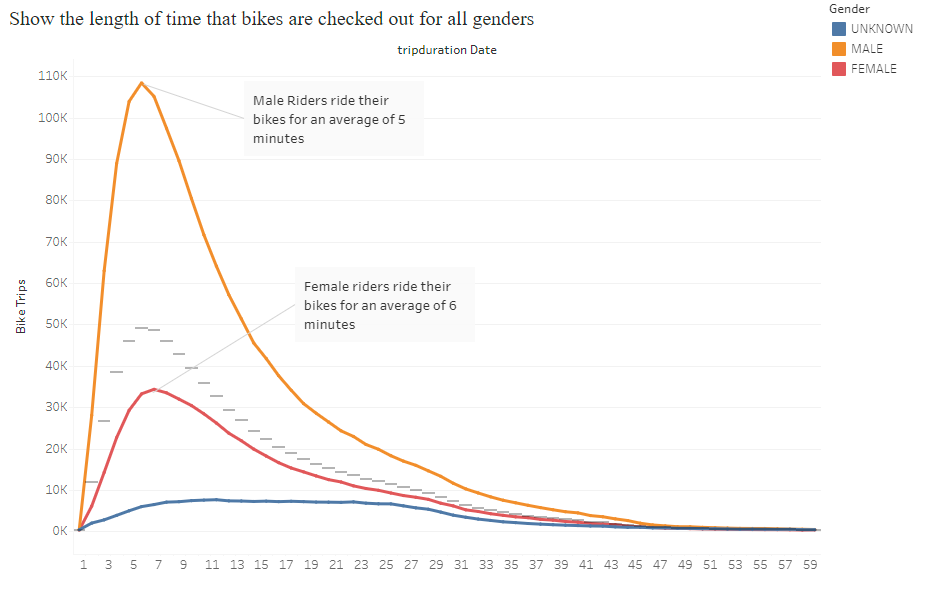
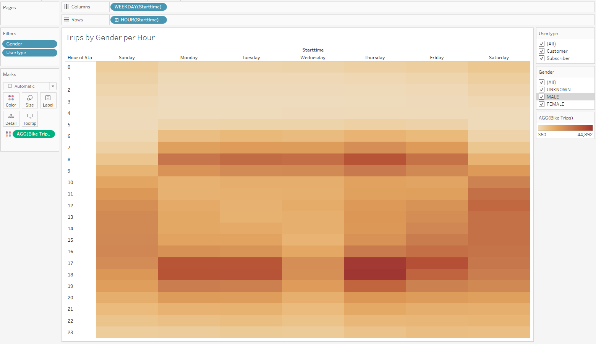
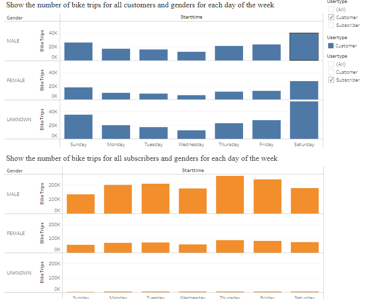
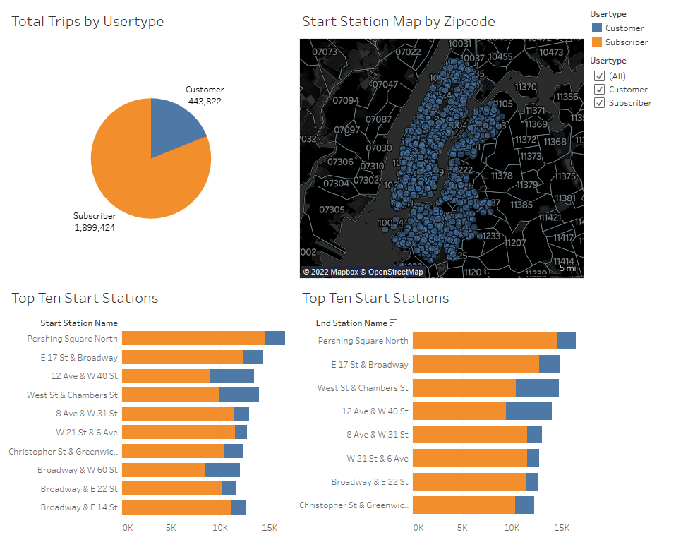
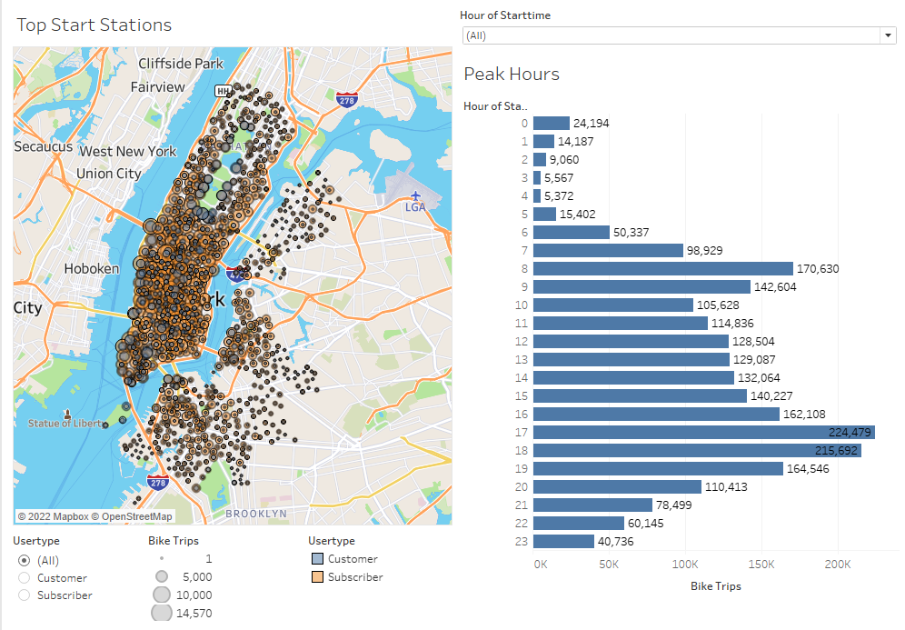
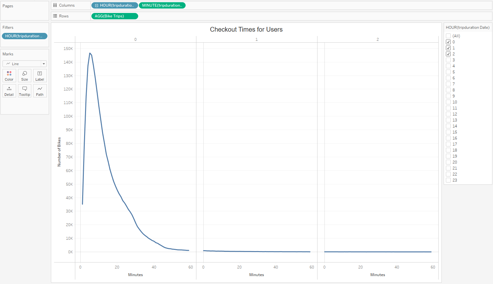

For more information, please check out our Tableau Storyboard site: [Tableau Storyboard](https://public.tableau.com/views/BikeRides2_0/CityBikeStory?:language=en-US&publish=yes&:display_count=n&:origin=viz_share_link "Link to Tableau Storyboard")

# CitiBike Project Overview 
Kate and I live in Des Moine, Iowa. We took a trip to NYC, and found their bike sharing opportunites. We loved it so much that we decided to see if we could do the same back home in Des Moine. First we needed to do some analysis on the bike sharing in NYC though. And that is what this project is focusing on. 

### Questions to Answer 
We have three questions that we are directing in specific during this study: 
    - 1. How long bikes are checked out for all riders and genders? 
    - 2. How many trips are taken by the hour for each day of the week, for all riders and genders? 
    - 3. A breakdown of what days of the week a user might be more likely to check out a bike, by type of user and gender? 

## Analysis
First we will answer the questions above, then we will step through the awesome visualizations we created in finding these answers!

### Overview of Statistical Analysis  
    - 1. How long bikes are checked out for all riders and genders? 
         A. We found that the bikes are checked-out on average approximately 6-7 minutes at a time. 

    - 2. How many trips are taken by the hour for each day of the week, for all riders and genders?
         A. Bike trips vary by hour of the day, with peak hours at 7-8am and 5-7pm. Check out our visuals on this next picture, the darker the area, the more use!

    - 3. A breakdown of what days of the week a user might be more likely to check out a bike, by type of user and gender?
         A.  Monday, Tuesday, Thursday, and Friday are the most popular times for Bike Sharing Subscribers to use the bikes. For general Customers, the weekends are the favored time. Note that the Subscriber users are colored Orange, and the Customer users are colored Blue,

### Results
The results of the study were impressive! We found that the bike sharing was used by many people througout the year. The data download recorded over 1 million uses! We found that using the these visualizations that the pictures are worth more than a thousand words...  
 

You can see (above) the locations by zip code where the predominate use was... mostly in the city. There was not much use outside the city. That is good to note! We wont be putting any bikes in the surrounding suburbs. Also it appears that most of the locations of heavy use are near a cross roads. Finally, we can depend upon the subscribers, but not necessarily the weekend users (customers). We will need to focus our Marketing on Subscriber use initially.  

This next visualization shows the peak hours of use by the year's total of bike shares: 
 
As you can see, the 8am time-frame and the 5-7pm timeframes are most popular. Want to know why? Its the users getting to and from work! For a subscriber, this is the cheapest mode of travel within the city, and there is no storing the bike in an office, or dread its going to be stolen for the user. Simply pick it up on the way to work, and drop it off a the nearest site near your workplace. You dont even have to worry about traffic jams, just ride around them! 

These next two visualizations highlights the checkout times: 
 
This one (above) is the Checkout times by Gender. 
 
This one (above) is the Checkout times by User. 

### Summary
This is an excellent tool of travel within city limits of a large city. But outside a large city may not be worth the price unless found at local parks along bike routes. Even so, most of those users will have their own bicycles. Check out this visualization on Gender usages:  
 
Most of our subscribers are Men. We will have to find ingenius ways to market to women as well. 

For more information, please check out our Tableau Storyboard site: [Tableau Storyboard](https://public.tableau.com/views/BikeRides2_0/CityBikeStory?:language=en-US&publish=yes&:display_count=n&:origin=viz_share_link "Link to Tableau Storyboard")

Thank you for your interest!
